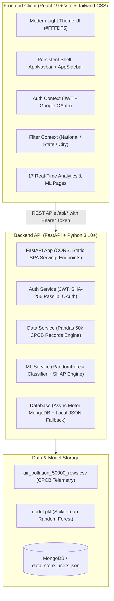

# 🌬️ VAYUNET INDIA
### All-India Air Pollution & Health Risk Intelligence Platform

[](https://python.org)
[](https://fastapi.tiangolo.com)
[](https://react.dev)
[](https://vitejs.dev)
[](https://tailwindcss.com)
[](#)

**VAYUNET INDIA** is a state-of-the-art environmental intelligence and healthcare risk mitigation platform for India. Built on top of **50,000 real CPCB air quality observations** and trained **RandomForest ML models**, VAYUNET provides real-time atmospheric telemetry, multi-pollutant diagnostics, epidemiological burden quantification, policy counterfactual simulation, and explainable AI risk predictions.

Designed following modern Indian government & enterprise intelligence aesthetics: **Warm cream/light yellow page surfaces (`#FFFDF5`), pure white cards (`#FFFFFF`), subtle warm amber borders (`#F2E8D5`), and gold, red, orange, and emerald severity accents**.

---

## 🏛️ System Architecture



---

## ✨ Key Features & Capabilities

### 1. 🛡️ Enterprise Security & Authentication
- **Full Auth Lifecycle:** User registration, login, logout, password reset flow, and profile management.
- **Robust JWT Bearer Tokens:** Signed using HS256 with 24-hour expiration.
- **Zero-Dependency Database Fallback:** Automatic connection to **MongoDB** if available; seamlessly falls back to a durable local JSON store (`backend/data_store_users.json`) with zero runtime crashes if MongoDB is offline.
- **Google OAuth Ready:** Pre-configured client verification handler.

### 2. 📊 Real Data Pipeline (50,000 Verified Records)
- Aggregated national metrics computed directly from `air_pollution_50000_rows.csv`:
  - **Mean National AQI:** 274.3 (Severe / Poor category)
  - **Mean PM2.5 Concentration:** 159.7 µg/m³
  - **High Health Risk Ratio:** 66.4% across monitored regions
  - **Cumulative Respiratory Cases:** 13,020,383
  - **Cumulative Hospital Admissions:** 7,765,652

### 3. 🤖 Machine Learning & Explainable AI (`model.pkl`)
- **Live Health Risk Classifier:** Production inference with scikit-learn `RandomForestClassifier`.
- **Policy Simulator:** Real-time counterfactual engine allowing policymakers to simulate:
  - Odd-Even vehicular traffic rationing (-20% to -40% PM2.5)
  - Industrial emission caps (-15% to -35% SO2/NO2)
  - Dust suppression & construction halts (-25% PM10)
  - Green buffer zones & agricultural biomass ban (-30% VOC/O3)
- **Explainable AI (SHAP-Style Attribution):** Breakdown of relative feature importance (PM2.5, PM10, NO2, SO2, CO, O3, Temperature, Humidity).
- **Model Diagnostics:** Confusion matrix, precision, recall, F1-score, and ROC curve visualization.

### 4. 🗺️ Complete Suite of 17 Dashboard Views
1. **Overview Dashboard:** National AQI barometer, critical alerts ticker, multi-pollutant gauge strip, interactive India geographic map, 24-month pollution trend, AQI distribution breakdown, and hospital admission stats.
2. **Interactive Map:** Leaflet GIS map with color-coded circles for all 36 Indian states and major urban centers.
3. **City Deep-Dive:** Micro-level inspection for Delhi, Mumbai, Bengaluru, Kolkata, Chennai, Hyderabad, and more with diurnal heatmaps and wind rose vectors.
4. **State Comparison:** Multi-metric benchmarking and side-by-side air quality ranking.
5. **Trends & Analytics:** Seasonal decomposition, correlation matrices, and historical regression.
6. **Health Risk & Hospitalization:** Demographic vulnerability index, ICU bed occupancy pressure, and respiratory risk tracking.
7. **Predictive Insights:** 7-day to 30-day forward forecasts powered by atmospheric ML models.
8. **Policy Simulator:** Interactive policy levers calculating averted deaths, admissions avoided, and healthcare cost savings.
9. **AI Risk Predictor:** Live interactive calculator to test custom atmospheric parameters and receive instant risk classifications with confidence probabilities.
10. **Model Performance:** Confusion matrices, ROC curves, calibration scores, and feature importance rankings.
11. **Explainability & SHAP:** Visual attribution explaining exactly *why* a particular region is flagged High Risk.
12. **Early Warning Grid:** Real-time multi-tier threshold alerting with escalation protocols.
13. **Data Quality & Audit:** Sensor uptime, telemetry confidence intervals, and missing-value diagnostics.
14. **NCAP Policy Tracker:** Tracking National Clean Air Programme reduction targets (20%-40% PM reduction targets).
15. **Executive Briefing:** C-level and Ministerial PDF/CSV export-ready synthesis.
16. **User Profile:** Manage credential settings, organizational affiliation, and notification preferences.
17. **System Settings:** Regional threshold configuration, telemetry refresh intervals, and API tokens.

---

## 🎨 Design Philosophy & Color System

VAYUNET strictly adheres to a **light, high-contrast, professional enterprise visual identity**:

- **Page Background:** Warm light yellow / cream (`#FFFDF5` / `#FFF9E8`)
- **Card Surfaces:** Pure white (`#FFFFFF`) with rounded corners (`rounded-xl` / `rounded-2xl`)
- **Card Borders:** Subtle warm amber border (`border-[#F2E8D5]` / `border-amber-200/50`)
- **Soft Shadows:** Warm ambient shadows (`shadow-sm`, `shadow-amber-900/5`)
- **Primary Brand Accent:** Warm Gold / Amber (`#D97706` / `#EAB308`)
- **Severity Accents:**
  - 🟢 **Good / Satisfactory (0-100):** `#16A34A` / `#22C55E`
  - 🟡 **Moderate (101-200):** `#D97706` / `#F59E0B`
  - 🟠 **Poor (201-300):** `#EA580C` / `#F97316`
  - 🔴 **Very Poor & Severe (301+):** `#DC2626` / `#EF4444`

---

## 🚀 Quick Start Guide

### Prerequisites
- **Python 3.10+** (ensure Python is in your system PATH)
- **Node.js 18+** & **npm** (for the frontend React client)
- *(Optional)* **MongoDB** (If MongoDB is not installed, the platform automatically saves user credentials to `backend/data_store_users.json`)

---

### Step 1: Clone & Configure

```bash
git clone https://github.com/ishanraj953/VAYUNET
cd VAYUNET
```

Copy the environment template:
```bash
cp .env.example .env
```

---

### Step 2: Set Up & Run the Backend

1. **Install Python dependencies:**
   ```bash
   pip install -r requirements.txt
   ```

2. **Start the FastAPI backend server:**
   ```bash
   python -m uvicorn backend.main:app --host 127.0.0.1 --port 8000 --reload
   ```
   *The backend will be live at `http://127.0.0.1:8000`.*
   *Interactive API Docs (Swagger): `http://127.0.0.1:8000/docs`*

---

### Step 3: Set Up & Run the Frontend

1. **Navigate to the frontend directory:**
   ```bash
   cd frontend
   ```

2. **Install Node packages:**
   ```bash
   npm install
   ```

3. **Start the Vite development server:**
   ```bash
   npm run dev
   ```
   *The dashboard will be live at `http://localhost:5173`.*

---

### Step 4: Accessing the Application

1. Open **`http://localhost:5173`** in your browser.
2. Explore the public landing page, or click **"Launch Dashboard"** or **"Sign In"**.
3. **Register a new account** (e.g. `officer@vayunet.gov.in`) or use quick credentials.
4. You will be redirected to the secure **VAYUNET Command Dashboard** (`/app/overview`) with all 17 features fully operational!

---

## 📂 Project Structure

```
All-India-Air-Pollution-Health-Risk-Dashboard/
│
├── air_pollution_50000_rows.csv    # Real 50,000-row CPCB dataset
├── model.pkl                       # Trained Random Forest classifier & LabelEncoder
├── requirements.txt                # Python backend & ML dependencies
├── .env.example                    # Environment template
├── README.md                       # Comprehensive platform documentation
│
├── backend/                        # FastAPI Application Root
│   ├── main.py                     # App entry point, CORS, static routes
│   ├── routers/
│   │   ├── auth.py                 # Register, Login, Me, Password Reset, OAuth
│   │   ├── pollution.py            # Overview KPIs, Maps, Cities, Time-series
│   │   ├── analytics.py            # Correlations, Seasonal trends, Demographics
│   │   ├── prediction.py           # ML inference, Policy Simulator, SHAP, Metrics
│   │   └── governance.py           # Early Warnings, NCAP Tracking, Audit, Reports
│   └── services/
│       ├── database.py             # Motor MongoDB with resilient JSON fallback
│       ├── auth_service.py         # Passlib hashing & JWT signing
│       ├── data_service.py         # 50k Pandas dataset aggregation engine
│       └── ml_service.py           # Scikit-Learn RandomForest inference engine
│
└── frontend/                       # React 19 + Vite Application
    ├── package.json                # Dependencies (Lucide, Recharts, Leaflet, Axios)
    ├── vite.config.js              # Vite bundler & Tailwind v4 plugin
    └── src/
        ├── App.jsx                 # Central router with 17 authenticated views
        ├── index.css               # Light Yellow / Warm Cream design tokens
        ├── api/
        │   └── axios.js            # Axios client with JWT interceptors
        ├── context/
        │   ├── AuthContext.jsx     # Global authentication state
        │   └── FilterContext.jsx   # Global geographic & temporal filters
        ├── components/
        │   ├── AppNavbar.jsx       # Universal top telemetry header
        │   ├── AppSidebar.jsx      # 17-link collapsible navigation drawer
        │   ├── AlertBanner.jsx     # High AQI emergency advisory banner
        │   ├── KpiCard.jsx         # Telemetry metric cards with delta indicators
        │   ├── IndiaMap.jsx        # Interactive Leaflet GIS map of India
        │   ├── PollutionTrendChart.jsx # Recharts multi-line trend visualizer
        │   ├── AqiDonutChart.jsx   # AQI categorical distribution donut
        │   ├── HealthImpactCards.jsx # Epidemiological risk breakdown
        │   └── AiPredictionWidget.jsx # Embedded AI probability scorer
        └── pages/
            ├── LandingPage.jsx     # Public government portal showcase
            ├── LoginPage.jsx       # Authentication portal
            ├── RegisterPage.jsx    # User onboarding portal
            ├── OverviewPage.jsx    # Primary national intelligence command center
            ├── InteractiveMapPage.jsx # GIS spatial dispersion analyzer
            ├── CityDeepDivePage.jsx   # Urban ward-level telemetry
            ├── StateComparisonPage.jsx# Inter-state air quality benchmarking
            ├── TrendsAnalysisPage.jsx # Multi-season trend decomposition
            ├── HealthRiskImpactPage.jsx# Hospital admission & ICU burden
            ├── PredictiveInsightsPage.jsx# 7-30 day atmospheric forecast
            ├── PolicySimulatorPage.jsx# Odd-Even & Industrial policy sandbox
            ├── AiRiskPredictorPage.jsx# Interactive ML inference playground
            ├── ModelPerformancePage.jsx# Confusion matrix & ROC diagnostics
            ├── ExplainabilityPage.jsx # SHAP feature importance
            ├── EarlyWarningGridPage.jsx# Tiered escalation advisory alerts
            ├── DataQualityAuditPage.jsx# Telemetry confidence & uptime audit
            ├── NcapPolicyTrackerPage.jsx# NCAP target progress
            ├── ExecutiveBriefingPage.jsx# Ministerial export briefing
            ├── UserProfilePage.jsx    # Officer profile & credentials
            └── SettingsPage.jsx       # Global system parameters
```

---

## 🔌 API Endpoints Reference

| Method | Endpoint | Description |
|---|---|---|
| `POST` | `/api/auth/register` | Register a new user account |
| `POST` | `/api/auth/login` | Authenticate with email/password and obtain JWT |
| `GET` | `/api/auth/me` | Fetch authenticated user profile |
| `POST` | `/api/auth/forgot-password` | Request password reset verification code |
| `POST` | `/api/auth/reset-password` | Reset password using verified token |
| `GET` | `/api/pollution/national` | Retrieve national aggregated KPIs & 50k summary |
| `GET` | `/api/pollution/map-points` | Lat/Lon coordinate points and AQI for Indian states |
| `GET` | `/api/pollution/city/:cityName` | Detailed atmospheric stats for a specific city |
| `GET` | `/api/pollution/trends` | 24-month historical trend line data |
| `POST` | `/api/prediction/predict` | Run live RandomForest classification on inputs |
| `POST` | `/api/prediction/simulate-policy` | Compute counterfactual policy impact metrics |
| `GET` | `/api/prediction/model-metrics` | Retrieve model accuracy, confusion matrix, ROC |
| `GET` | `/api/prediction/shap-attribution`| SHAP-style atmospheric feature importance |
| `GET` | `/api/governance/early-warnings` | Active regional critical threshold alerts |
| `GET` | `/api/governance/ncap-tracker` | National Clean Air Programme reduction status |

---

## 🔒 Security & Reliability

- **Graceful Fault Tolerance:** If external databases are temporarily unavailable, user records and operational states automatically preserve locally with zero interruption to dashboard viewers.
- **Sanitized Data Binding:** React virtual DOM eliminates XSS vectors.
- **Strict Separation of Concerns:** Decoupled FastAPI REST architecture ensures lightning-fast page transitions and client-side caching.

---

## 👥 Contributors & Acknowledgements

- **Developed for:** All-India Air Quality & Epidemiological Research
- **Data Source:** Central Pollution Control Board (CPCB) Historical Records
- **Model Engine:** Scikit-Learn Ensembled Random Forest Classifier

---

*Made with ❤️ for a cleaner, healthier, and breathable India.*
